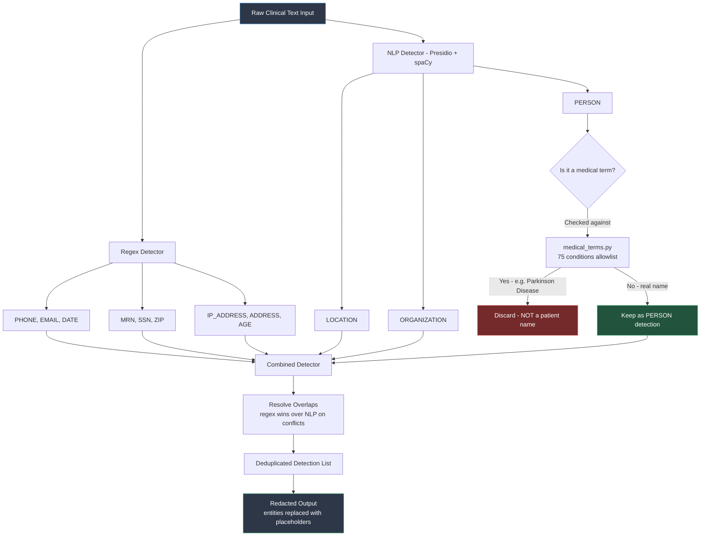
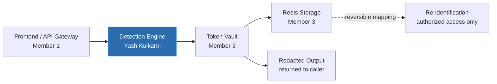
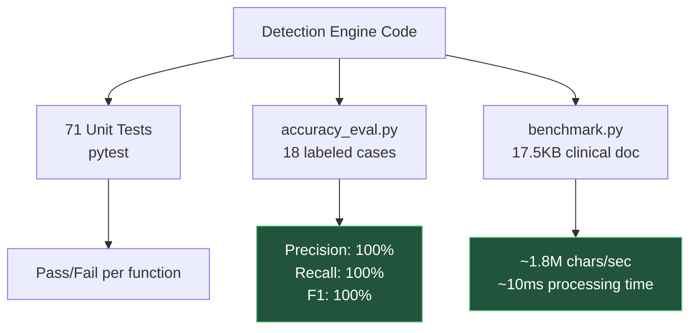

# Detection Engine — Architecture Diagram

**Owner:** Yash Kulkarni (Detection Engine Lead)

This diagram shows how raw clinical text flows through the detection
engine to produce redacted output. It covers the regex layer, the NLP
layer, the medical term protection system, and where this component
fits in the overall PHI/PII redaction pipeline.

## Detection Engine Flow

## Where This Fits in the Full Pipeline

## Test & Evaluation Flow

## Notes for the report/presentation

- The **medical term protection** step (yellow diamond in diagram 1) is the
  single most important design decision in this module — it's the direct
  fix for the "Parkinson Disease must not be redacted" requirement from
  the team roadmap.
- The **combined detector** merges two independently-built layers (regex
  and NLP) without either one needing to know about the other — this
  keeps the code modular and testable in isolation.
- These diagrams render automatically on GitHub (no external tool
  needed) since GitHub supports Mermaid syntax natively in Markdown
  files.
